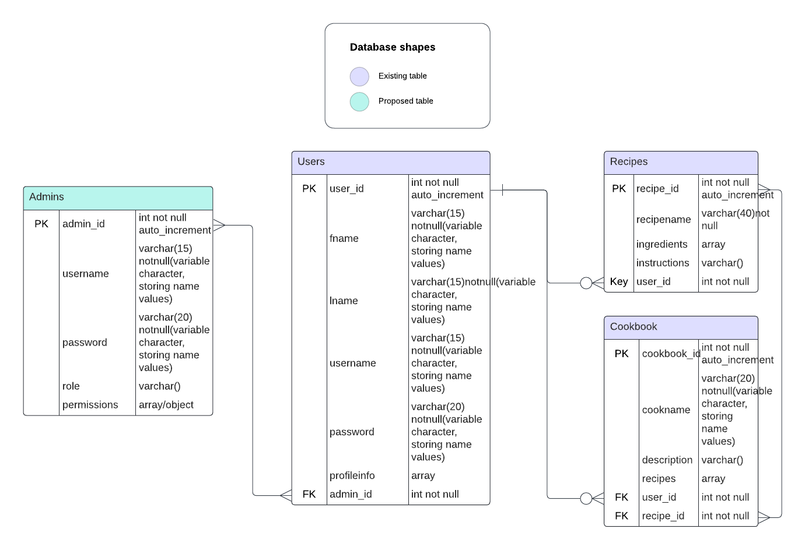

# Fridge-Forager
301-final-project

## User Stories 

As a __, I want __, so that ___

User stories can be described as:

Short, simple, and open for interpretation
Presented to the developer (from the client) as the behavior they wish to see in their app. The user story should not present a solution.
Should clearly communicate the end goal of the user
Includes Acceptance Testing

1. As someone who is constantly overworked(self-proclaimed), I want to be able to access this app when I forget to go to the grocery store, so that I can use what I have on hand to make myself a healthy meal.
2. As a poor college student, I HATE throwing away food, so I would like recipes to make some bomb ramen.
3. As someone with dietriarian restrictions, I want to be able to eat good meals with the food Im allow to eat, so that I wont starve.
4. As a pet lover, I want to use this app to feed myself instead of always feeding my pets, so that I can be healthy and provide for the pets who eat all my own food.
5. As a food cook lover, I want a way to be able to upload my recipes and photos of food I professionally cooked, so that I can show the world how awesome my food is.

## Software Requirements

### Vision

Fridge Forager is an application where a user can input what ingredients they have available to them. Once entered, using various APIs, the user will receive feedback which displays the available recipes. The biggest pain point this project is solving is to help people not waste food and give them ideas on new recipes they'll discover on the app. It also solves the problem of an individual not knowing what to make with what ingredients they have available. This product will help people manage their ingredients and inspire them to make new recipes and give them ideas on new recipes they'll discover on the app.

### Scope (In/Out)

- IN
    - The app will provide recipes for users
    - The app will allow users to search for recipes
    - The app will allow users to upload pictures of food
    - The app will allow users to upload comments
    - The app will allow users to like recipes
    - The app will allow users to create, delete and share recipes

- OUT
    - The app will not provide addresses from users
    - The app will not be allowing users to make changes on other users profiles and recipes.

### MVP

- What is the minimum required for you to present on your demo day?

    - User profile
    - User authentication
    - Input form
    - API generated recipes
    - Photo upload
    - Calorie Counting/Nutrition Facts

- Stretch goals

    - User Comments
    - Mini-Game
    - API Integration with DoorDash
    - Dietary Restrictions
    - Food Allergies
    - Like Photo/Gallery of most liked photos
    - Input personal recipes
    - Premium Features

### Functional Requirements

1. An admin can create and delete user accounts
2. A user can update their profile information
3. A user can search shared recipes by other users, upload pictures of food, and upload comments
4. A user can like and unlike recipes, create and delete recipes
5. A user can have private information regarding recipes

### Non-Functional Requirements

1. Security: To make sure users can access information that they are privided to them. Secure sensitive information such as passwords.

2. Usability: Ensure users can understand the purpose of the app as well as navigate through it with ease. Maintain high accessibility standards for the application.

### DOMAIN MODELING

### WIREFRAME

### DataBase Schema Diagram

